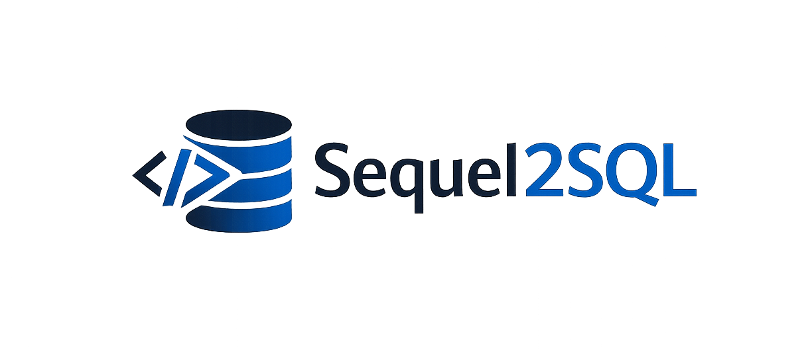
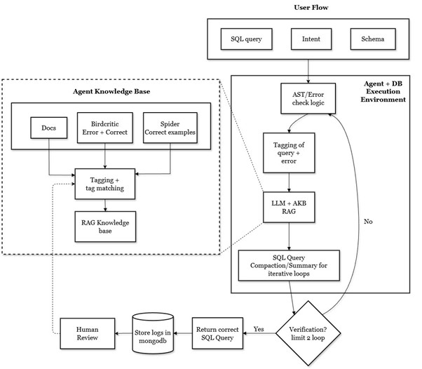
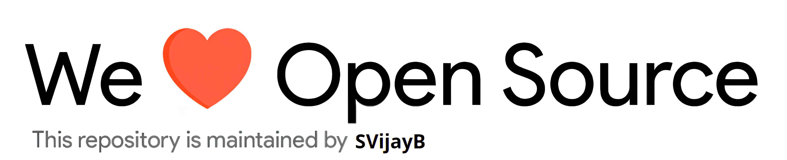

# Sequel2SQL

<p align="center">
    
    <br>An agentic LLM + RAG framework for PostgreSQL error diagnosis, optimization, and correction.
</p>

---

<p align="center">
    <a href="https://github.com/SVijayB/sequel2sql/pulls">
        
    </a>
<a href="https://github.com/SVijayB/sequel2sql/issues">
    
    </a>
<a href="https://github.com/SVijayB/sequel2sql/graphs/contributors">
    
    </a>
<a href="https://github.com/SVijayB/sequel2sql/blob/master/LICENSE">
    
    </a>
<a href="https://github.com/SVijayB/sequel2sql">
    
    </a>
<a href="https://github.com/SVijayB/sequel2sql/blob/master/.github/CODE_OF_CONDUCT.md">
    
    </a>
<a href="https://github.com/SVijayB/sequel2sql/blob/master/.github/CONTRIBUTING.md">
    
    </a>
</p>

## Table of Contents

-   [Motivation](#Motivation)
-   [Installation](#Installation)
-   [Docker Setup](#Docker-Setup)
-   [Contributing](#Contributing)
-   [License](#License)

## Motivation

<!--- Insert product screenshot below --->

This is a capstone project for the MS in Data Science program at the University of Washington, Seattle, sponsored by Microsoft and guided by [Dhruv Relwani](https://www.linkedin.com/in/dhruvrelwani/).

The primary objective of this project was to build a system that can help data engineers in diagnosing, optimizing, and correcting SQL queries for PostgreSQL databases. While most LLMs are good at generating SQL queries from natural language (NL2SQL), they often struggle with fixing error queries and that is where Sequel2SQL comes in.

Sequel2SQL uses retrieval-augmented generation and agent-based workflows by leveraging database schemas, official documentation, and past correction examples, making SQL debugging more reliable and easier to reason about, thereby improving accuracy of query corrections.

<p align="center">
    
</p>


## Installation

For the latest stable version, head to [releases](https://github.com/SVijayB/sequel2sql/releases) and download the source code, or clone the repository directly:

```bash
git clone https://github.com/SVijayB/sequel2sql
cd sequel2sql
```

### Quick Setup (Recommended)

Use the interactive setup script to configure everything automatically:

```bash
uv run python setup.py
```

This will guide you through:
- Installing dependencies
- Configuring API keys
- Setting up Docker containers
- Verifying database connectivity

For advanced options:

```bash
uv run python setup.py --help
```

```
usage: setup.py [-h] [--benchmark] [--skip-docker] [--skip-prompts] [--api-key API_KEY] [--check-only]

options:
  --benchmark        Setup for full benchmark (includes data validation)
  --skip-docker      Skip Docker container setup
  --skip-prompts     Non-interactive mode (use defaults)
  --api-key API_KEY  Google API key (avoids prompting)
  --check-only       Run pre-flight checks only, don't setup
```

### Manual Setup

This project uses [uv](https://github.com/astral-sh/uv) for fast, reliable Python package management. Install it with:

```bash
pip install uv
```

Install dependencies:

```bash
uv sync
```

This automatically creates a virtual environment and installs all required packages.

## Usage

Run the application:

```bash
uv run python sequel2sql.py
```

### Project demo


You can also find the demo video [here](https://www.youtube.com/watch?v=dQw4w9WgXcQ).

## Contributing

To contribute to Sequel2SQL, fork the repository, create a new branch and send us a pull request. Make sure you read [CONTRIBUTING.md](https://github.com/SVijayB/sequel2sql/blob/master/.github/CONTRIBUTING.md) before sending us Pull requests.

Thanks for contributing to Open-source! ❤️

## License

Sequel2SQL is under The MIT License. Read the [LICENSE](https://github.com/SVijayB/sequel2sql/blob/master/LICENSE) file for more information.

---


